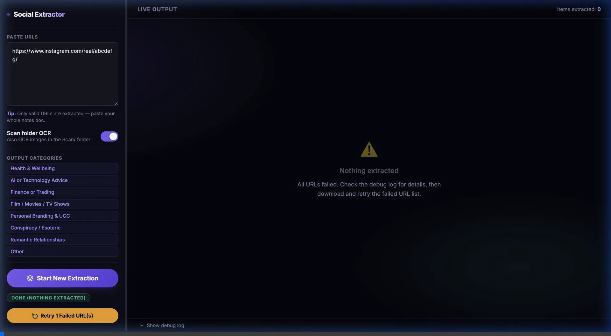

# Mass Social Wisdom Agent

An autonomous, multimodal AI agent that pulls wisdom from two sources at once - a **batch of social media URLs** and a **folder of local images** - then unifies everything into a single, beautifully organised knowledge document.

Paste dozens of Instagram Reels, Instagram Posts (carousels & images), and YouTube videos into the UI. At the same time, drop screenshots, slide decks, or any image files into the local `Scan/` folder. The agent extracts transcripts, runs OCR on every image, self-assesses its own output quality, and exports a structured `.docx` file where all content is automatically sorted into topic subheadings - ready to drag into Notion.

The agent inspects each input, selects the right extraction strategy, invokes the appropriate tools, composes the output with an LLM, evaluates the result, self-corrects if needed, and exports - all without human input after the initial trigger.

Built with **Flask**, **Google Gemini 2.5 Flash**, and the **SociaVault API**.

  

<br/>



---

## Agent Architecture

This system implements an autonomous **observe → reason → act → self-correct** loop for every piece of content:

```
Input URL
    │
    ▼
[1. INSPECT]    Classify URL: reel / carousel / video post / static image / YouTube
    │
    ▼
[2. ROUTE]      Select the right tool chain:
                ├─ Instagram Reel    → SociaVault transcript API + caption
                ├─ Instagram Carousel → Gemini Vision OCR (per slide) + caption
                ├─ Instagram Video   → SociaVault transcript API + caption
                ├─ Instagram Image   → Gemini Vision OCR + caption
                └─ YouTube          → SociaVault transcript API
    │
    ▼
[3. COMPOSE]    Gemini 2.5 Flash fuses raw inputs into polished, detailed prose
    │
    ▼
[4. SELF-ASSESS] Agent scores its own output quality (1–5 via Gemini)
    │
    ├── Score < 3 → [RETRY] Re-compose with a lenient strategy
    │                        ├─ Compare retry vs. original
    │                        └─ Keep the better result, log the decision
    │
    └── Score ≥ 3 → Proceed
    │
    ▼
[5. CATEGORISE]  Keyword overrides + Gemini reasoning → 1 of 8 output categories
    │
    ▼
[6. SORT]        Gemini reorders items by topic similarity within each category
    │
    ▼
[7. EXPORT]      Structured .docx → Notion-importable Word document
```

The **Self-Assess → Retry** loop (steps 4–5) is what distinguishes this from a standard pipeline. The agent observes the quality of its own output, reasons about whether it meets the standard, and acts differently if it doesn't - a core property of autonomous agents.

---

## The User Journey

Here is exactly how you will use this app from start to finish:

### 1. Get Your API Keys
To power the AI and social scraping, you need two APIs. You'll place these keys in a `.env` file in the root of the project:
- **Google Gemini API**: Get your free key at [Google AI Studio](https://aistudio.google.com/app/apikey). This acts as the agent's brain for OCR, content composition, quality assessment, and categorisation.
- **SociaVault API**: Get your key at [SociaVault](https://sociavault.com). This handles extracting transcripts and captions from Instagram and YouTube URLs.

### 2. Feed the Agent — Two Input Channels

The agent accepts two types of input simultaneously in every session:

#### 📋 Channel 1: Social Media URLs
Copy any mix of Instagram (Reels or Posts) or YouTube URLs and paste them directly into the text panel. **You don't need to clean them.** Paste your entire notes document, a WhatsApp conversation, or a wall of text with URLs buried inside — the agent automatically detects and extracts every valid link, strips tracking parameters (`?igsh=...`, `utm_*`), and deduplicates them before processing.

The agent then classifies each URL and picks the right tool:
- **Instagram Reels** → transcript via SociaVault + caption
- **Instagram Carousels** → slide-by-slide Gemini Vision OCR + caption
- **Instagram Videos** → transcript + caption
- **Instagram Static Images** → Gemini Vision OCR + caption
- **YouTube Videos** → full transcript

#### 🖼️ Channel 2: Local Image OCR (the Scan Folder)
This is the hidden power feature. Have a folder of screenshots from a course, a presentation deck saved as images, financial charts, or any text-heavy images you've been hoarding? Drop them all into the `Scan/` folder before starting the agent.

The agent scans this folder at startup, OCR-s every image using Gemini Vision, and treats each one as a first-class content item — composing, categorising, and including it in the same final document as your URLs. **After processing, each image is automatically moved to `Processed/` so your Scan folder stays clean for the next session.**

### 3. Run the Agent
- Open the web interface at `http://127.0.0.1:5001`.
- Paste your URLs into the left panel. Use the **Scan Folder OCR** toggle to include or exclude your local images from the current session.
- Click **Start Extraction** and watch the right panel update in real-time - the agent logs every decision it makes: which tool it's calling, the quality score it assigned, whether it chose to retry, and which category it filed each piece of content into.

### 4. Receive Your Knowledge Document
Once finished, click **Download Results** to receive a structured `.docx` file that looks like this:

```
Mass Social Wisdom Agent - Session Results
[Date & time]

━━━━━━━━━━━━━━━━━━━━━━━━━━━━━
Finance or Trading Advice or Tools
━━━━━━━━━━━━━━━━━━━━━━━━━━━━━
  Source: https://www.instagram.com/reel/abc123/
  [Full composed prose — not a summary, a faithful reconstruction]
  ────────────────────────────────────────────────────────────
  Source: screenshot_polymarket_tips.png
  [OCR'd and composed text from your local image]
  ────────────────────────────────────────────────────────────

━━━━━━━━━━━━━━━━━━━━━━━━━━━━━
Health & Wellbeing
━━━━━━━━━━━━━━━━━━━━━━━━━━━━━
  Source: https://www.youtube.com/watch?v=xyz
  [Composed transcript — all detail preserved]
  ────────────────────────────────────────────────────────────
```

- Every section is an **H1 heading** (category name), so Notion's importer creates a proper page hierarchy automatically.
- Within each category, items are **sorted by topic similarity** - so related videos and posts cluster together naturally.
- Source links are embedded under each entry so you can trace every piece of content back to its origin.
- Any URLs that failed to process are saved to a `failed_urls_*.txt` file you can paste back in for a retry run.

---

## Features

- **Autonomous Agent Loop**: A genuine observe → reason → act → self-correct cycle runs for every URL processed.
- **Self-Quality Assessment**: After composing each output, the agent scores its own work (1–5) using Gemini and retries with a lenient strategy if the score is below 3.
- **Dual-Channel Input**: Process social media URLs and local image files simultaneously in a single session — the agent handles both and merges everything into one unified output.
- **Scan Folder OCR**: Drop any image files (`.png`, `.jpg`, `.webp`, etc.) into the `Scan/` folder before running. The agent OCR-s each one with Gemini Vision, composes the extracted text, categorises it, and includes it in the final document alongside your URL content. Images are automatically moved to `Processed/` after handling.
- **Multi-Platform URL Extraction**: Paste raw, messy text — the agent finds and cleans every valid Instagram or YouTube URL automatically.
- **Carousel & Image Post OCR**: Instagram carousels are processed slide-by-slide via Gemini Vision, preserving the full content of multi-image educational posts.
- **Intelligent Composition**: Raw transcripts, OCR data, and captions are woven together by Gemini into polished, detailed prose — not a summary, but a faithful reconstruction that preserves every anecdote and example.
- **Auto-Categorisation**: Every item is automatically filed into one of 8 categories (Finance, AI, Health, Romance, Film, Conspiracy, Personal Branding, or Other) using fast keyword overrides and Gemini reasoning.
- **Similarity Sorting**: Within each category, Gemini reorders items by topic proximity so related content clusters together naturally.
- **Beautifully Organised Output Document**: The final `.docx` uses H1 category headings, embedded source links, and consistent formatting — purpose-built for Notion import but readable as a standalone reference document.
- **Live "Liquid Glass" UI**: A real-time dual-column interface lets you watch the agent process each item as it happens, including quality scores and retry decisions visible in the debug log.
- **URL Sanitisation**: Auto-strips Instagram tracking parameters (`igsh`, `si`, `utm_*`) and unwraps login-redirect URLs before hitting the API.

---

## Quick Setup Guide

1. **Clone the repo**
   ```bash
    git clone https://github.com/raminhoodeh/mass-social-wisdom-agent.git
    cd mass-social-wisdom-agent
   ```

2. **Set up a virtual environment**
   ```bash
   python -m venv venv
   source venv/bin/activate   # Windows: venv\Scripts\activate
   ```

3. **Install dependencies**
   ```bash
   pip install -r requirements.txt
   ```

4. **Configure your API keys**
   Copy the example env file and fill in your keys:
   ```bash
   cp .env.example .env
   ```
   *Open `.env` and add your Gemini and SociaVault API keys.*

5. **Run the agent**
   ```bash
   python app.py
   ```
   Open **http://127.0.0.1:5001** in your browser.

---

## Directory Structure

```
mass-social-wisdom-agent/
├── app.py                  # Agent core — routing, tool invocation, self-assessment, export
├── requirements.txt        # Python dependencies
├── .env.example            # API key template (copy to .env)
├── templates/
│   └── index.html          # Real-time Liquid Glass UI
├── Scan/                   # Drop local images here for OCR
├── Processed/              # Images are moved here after OCR (auto-managed)
└── Results/                # .docx exports + failed URL logs (auto-managed)
```

---

## Tech Stack

| Layer | Technology |
|---|---|
| Backend | Python 3.10+, Flask 3.0 |
| AI / LLM | Google Gemini 2.5 Flash (`google-genai`) |
| Image OCR | Gemini Vision API via Pillow |
| Social Scraping | SociaVault API |
| Export | `python-docx` |
| Frontend | Vanilla HTML/CSS/JS (no framework) |
